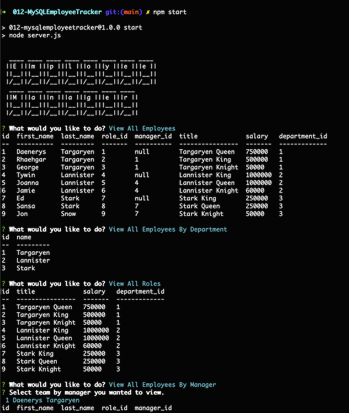
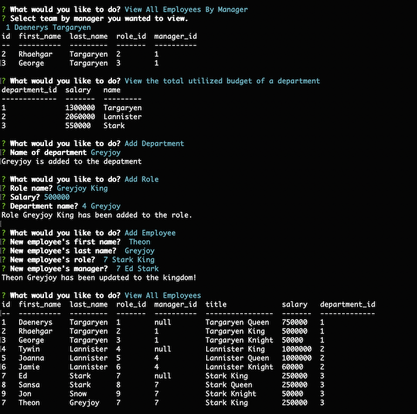
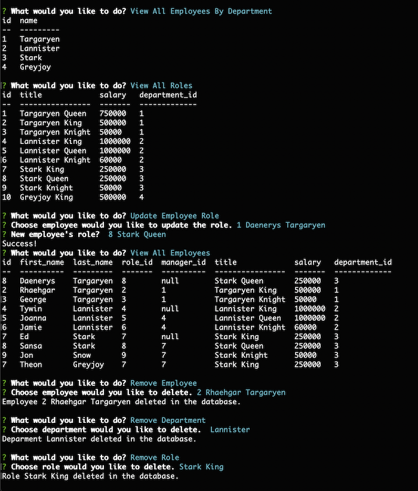

# MySQL Employee Tracker

A terminal based Content Management System using node, inquirer, and MySQL. The Employee Tracker is a way to display information stored in the database for non-developers. The project will be using the CRUD 

## Table of Contents

- [About the App](#about-the-app)
- [Usage](#usage)
- [Installation](#installation)

## About the App

- The Employee Tracker is an app for managers/employers to track employee, department, roles in a company. This will allow managers/employers to add new employee, roles, and department.
- Built in the following technologies:
    - MySQL
    - Inquirer
    - console.table
    - MySQL Workbench

## Installation
- 
- Github Page [Read Me](https://chabivz.github.io/012-MySQLEmployeeTracker/)
- Heroku [Page](#)
- Make sure to download packages
    - MySQL
    - Inquirer
    - console.table

## Usage

 - Go to [Github Repo](https://github.com/Chabivz/012-MySQLEmployeeTracker)
 - Go to the 

Employee Tracker Demo \

\
Snippets \

\
Snippets \

\
Snippets \

\
